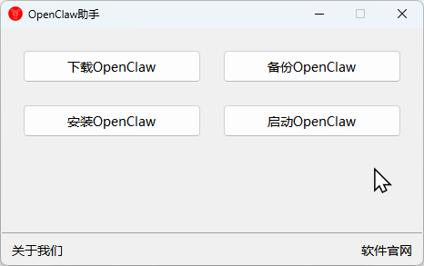

### OpenClaw助手
- 简单易用的OpenClaw养虾助手。[下载](https://github.com/ymtagi/openclaw/releases)OpenClaw助手，解压后运行，开启您的OpenClaw养虾之旅。

- OpenClaw核心功能支持：
	- 一键下载最新稳定版OpenClaw。
	- 全自动安装，安装完成后启动dashboard即可进行OpenClaw功能设置。
	- 内置常用skills: 办公、笔记、翻译、搜索、视频、天气、日程......
	- 一键启动/停止OpenClaw服务。
	- 一键完成OpenClaw核心数据备份。
	- 一键完成OpenClaw新版本更新。
- 获取服务授权码，请邮件[联系我们](ymaigc@126.com)。
- 如需功能定制、二次开发，请邮件[联系我们](ymaigc@126.com)。
